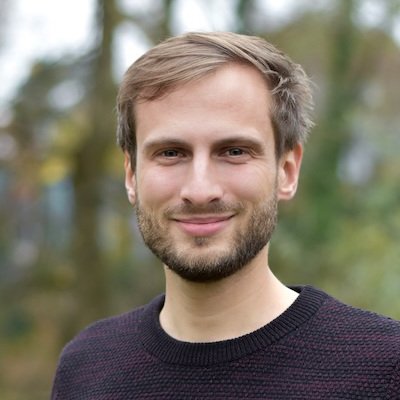

## 👥 Who We Are

We are a team of two passionate educators dedicated to making AI and machine learning accessible across disciplines. Our mission is to bridge the gap between technical foundations and societal impact through collaborative, hands-on learning.

  

    

      
    

    <h3>Dr. Christoph Weisser</h3>
    

      Technical Lead Analytics & AI 
      BASF
    

    

      
<strong>Ph.D.</strong> in applied statistics

      
<strong>Research:</strong> applied statistics and data science, forecasting, agentic systems

      
Passionate about teaching and business data science

    

    

      

        💼 <a href="https://linkedin.com/in/christophweisser" target="_blank"><strong>LinkedIn</strong></a>
      

    

  

  

    

      
    

    <h3>Dr. Knut Zoch</h3>
    

      Physicist 
      Harvard University
    

    

      
<strong>Ph.D.</strong> in experimental particle physics

      
<strong>Research:</strong> big data analytics at CERN, machine learning for science

      
Passionate about teaching and interdisciplinary science

    

    

      

        💼 <a href="https://linkedin.com/in/knutzk" target="_blank"><strong>LinkedIn</strong></a>
      

    

  

  We look forward to learning and exploring with you!

## 🎯 Our Mission

We believe that understanding AI and machine learning should not be limited to data scientists. By creating accessible, interdisciplinary educational experiences, we aim to:

- **Democratize AI education** across all academic disciplines
- **Foster critical thinking** about AI's role in society
- **Build bridges** between technical expertise and societal impact
- **Empower educators** with flexible, reusable teaching materials
